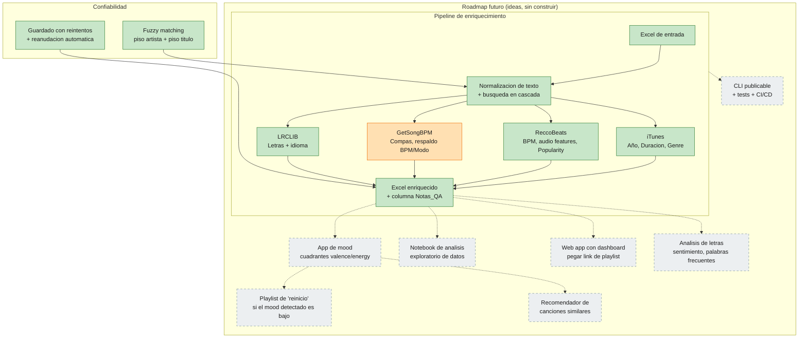

# Estado del proyecto — app_songs_avance_act_1

> Generado el 2026-09-24. Ver `README.md` para instrucciones de uso;
> este documento es la vista rápida de "qué hay" y "qué podría venir".

**Leyenda:** 🟢 hecho · 🟠 hecho, con limitación conocida · ⬜ (punteado) idea a futuro, sin código todavía

## Hecho

- **Pipeline completo** de 4 APIs (iTunes, ReccoBeats, GetSongBPM, LRCLIB) que lee un Excel y llena metadata, audio features, letras e idioma.
- **Matching robusto**: normaliza texto (apóstrofes raros), usa el nombre "oficial" que confirma iTunes/ReccoBeats para búsquedas en cascada, y exige un piso mínimo de parecido en artista *y* título por separado (evita el bug real que encontramos de "misma artista, canción equivocada").
- **Confiabilidad operativa**: guardado con reintentos si el Excel está abierto, reanudación automática si se corta a la mitad, nunca truena por una sola canción fallida.
- **Auditoría**: columna `Notas_QA` que documenta cada match dudoso o fuente que no encontró nada, fila por fila.
- Resultados en el set de prueba de 100 canciones: 85-96% de llenado en la mayoría de columnas.

## Con limitación conocida

- **Compás de la canción** (~25% de cobertura): la única fuente gratuita que lo da es GetSongBPM, y su catálogo es mucho más chico que el de Spotify/Apple Music. Se investigaron alternativas (Essentia/librosa para estimarlo del audio, AcousticBrainz) y ninguna es viable gratis y confiable para este proyecto — queda documentado en el README como limitación real, no como pendiente de arreglar.
- **Popularity**: se resolvió vía ReccoBeats (su catálogo espejo de Spotify sí expone ese campo, a diferencia de la API de Spotify directa que lo bloqueó tanto con Client Credentials como con login de usuario real).

## Roadmap futuro (solo ideas, platicadas pero no construidas)

Todas parten de que el pipeline ya entrega, por canción, `valence` y `energy` (0-1) — la base técnica del [circumplex de afecto de Russell](https://en.wikipedia.org/wiki/Emotion_classification#Circumplex_model) usado en psicología musical:

| Valence \ Energy | Alta | Baja |
|---|---|---|
| **Alta** | Feliz / eufórico | Relajado / en paz |
| **Baja** | Enojado / tenso | Triste / apagado |

- **App de detección de mood**: clasifica cada canción en un cuadrante usando valence+energy.
- **Modo "similar"**: recomienda canciones del mismo cuadrante que lo que el usuario está escuchando/sintiendo.
- **Modo "reinicio"**: si el mood detectado es bajo (triste/apagado), ofrece deliberadamente una playlist del cuadrante opuesto (alegre/enérgico) para intentar levantar el ánimo.
- **Notebook de análisis exploratorio**: graficar tendencias sobre las 200 canciones reales (¿tu música es más o menos energética que hace 5 años? ¿qué artista es el más "danceable"?).
- **Web app con dashboard**: pegar un link de playlist de Spotify/YouTube y que regrese el enriquecimiento + visualización, sin tocar terminal. Deployable gratis (Render/Railway) como demo de portafolio.
- **Recomendador basado en audio features**: ya se tienen los vectores (danceability, valence, energy, acousticness...) — un "canciones parecidas a esta" es extensión directa, no requiere nueva infraestructura de datos.
- **Análisis de letras**: ya se descargan con LRCLIB — sentimiento, palabras más frecuentes, comparación por idioma/artista.
- **CLI publicable**: empaquetar como herramienta instalable (`pip install`), con tests (`pytest`) y CI/CD (GitHub Actions) — buen ejercicio técnico sobre un proyecto ya entendido de cabo a rabo.

## Mantenimiento de este documento

Si vuelves a esta skill en una sesión futura para actualizar el roadmap, compara contra este archivo antes de regenerar: mueve ideas de "Roadmap futuro" a "Hecho" según lo que realmente se haya construido, en vez de reconstruir el diagrama desde cero.
